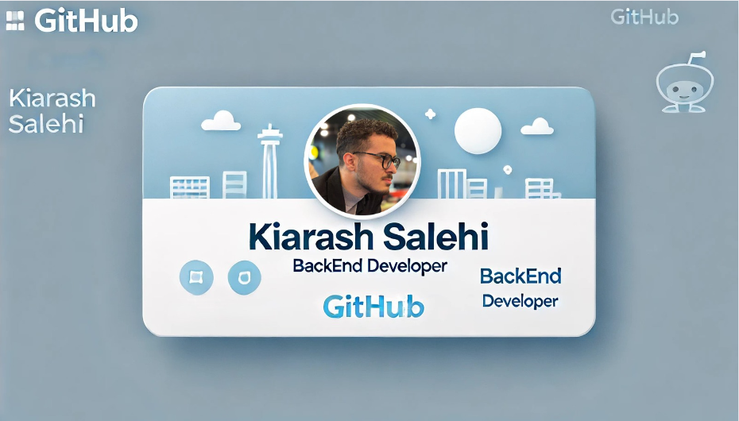

# Hi, I'm Kiarash Salehi! 👋

I'm a backend developer with a passion for building scalable and efficient systems. With 2 years of professional experience, I specialize in TypeScript and Golang. I'm also pursuing a Bachelor's degree in Computer Science and currently working full-time.

## 🛠 Technical Skills

## 💼 Professional Experience

### Backend Developer

_Domil.io_ — _Tehran_  
_June 2022 – Present_

- Developed and maintained backend services using TypeScript and Golang.
- Implemented and optimized search functionalities using Elasticsearch.
- Managed database operations with PostgreSQL, MongoDB, and Redis.
- Utilized Git for version control and collaborated with team members through GitHub.
- Employed Docker for containerization.

### Projects

#### Jeanswest (Ecommerce Fashion Website)

- **Technologies:** TypeScript, Nest.js, PostgreSQL, Redis, Elasticsearch, RabbitMQ, Swagger, SemVer versioning
- Implemented fast price calculation for multiple promotion types.
- Designed and implemented caching using Redis.
- Developed search functionalities using Elasticsearch.
- Handled time-consuming and sequential updates with RabbitMQ.

#### Q&A Game

- **Technologies:** TypeScript, Nest.js, Redis, MongoDB, RabbitMQ, Jest
- Designed and implemented a question and answer game supporting over 10 concurrent users.
- Utilized Redis and MongoDB for caching and data management.
- Handled sequential updates using RabbitMQ.

#### SMS Service

- **Technologies:** Golang, PostgreSQL, Redis, MongoDB, Kafka, GRPC
- Developed a service to handle SMS requests using Kafka, GRPC, or API.
- Implemented pipeline and fan-in/fan-out concurrency patterns.
- Focused on Domain-Driven Design (DDD) for service architecture.

#### Mega Wallet

- **Technologies:** TypeScript, Nest.js, PostgreSQL, MongoDB, Redis, Docker, Jenkins, Swagger, Jest
- Created a gateway for ecommerce applications to use gift cards for discounts.
- Developed the service with a B2B approach for corporate clients.

## 📫 Contact Me

- **Email:** [skiarash82@gmail.com](mailto:skiarash82@gmail.com)
- **LinkedIn:** 
- **GitHub:** 

## 📈 GitHub Stats

